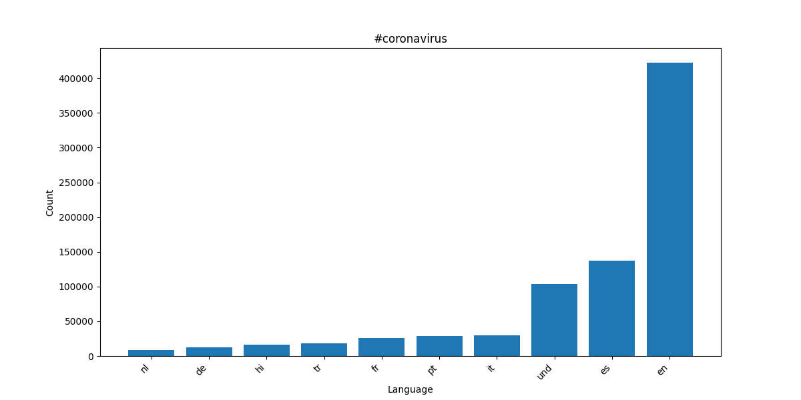
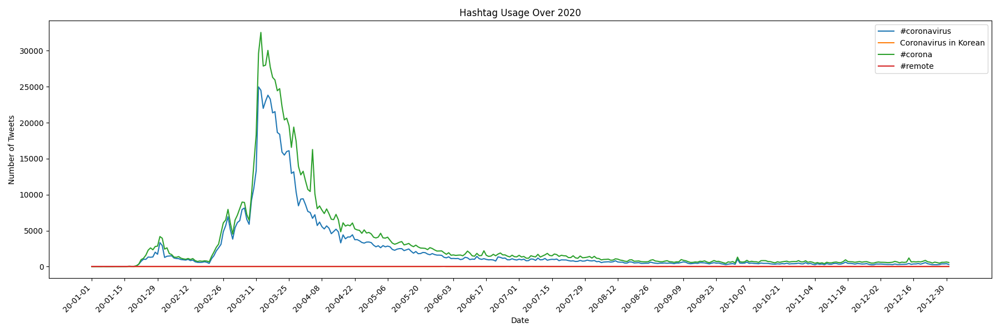

# Twitter Coronavirus Analysis

## Overview
This project analyzes geotagged tweets from 2020 to track the number of COVID-19 related hashtags across different languages and countries. The 2020 geotagged Twitter dataset contained approximately 1.1 billion tweets, which were processed using the MapReduce technique.

## MapReduce Breakdown
- `map.py`: Processes all 366 days in 2020 in parallel using `nohup` and `&` and extracting hashtag keys by country and language for each day.
- `reduce.py`: combines 366 outputs into single file for country and language keys.
- `visualize.py`: Generates bar chart of coronavirus related tweets by country and language
- `alternative_reduce.py`: Generates line chart of the count of coronavirus related tweets for the language and country keys over 2020  

## Results

### #coronavirus by Language

### #coronavirus by Country

### #코로나바이러스 (Coronavirus in Korean) by Language

### #코로나바이러스 (Coronavirus in Korean) by COuntry

### Coronavirus Related Hashtag Usage Over 2020

## Key Observations
- `#coronavirus` was predominantly used in English-speaking countries, with the US accounting for the highest number of #coronavirus related tweets

- `#코로나바이러스` was almost exclusively used in Korean (`ko`), which was expected given it is the Korean word for coronavirus.
- Both hashtags show a sharp spike in usage in March 2020, which corresponds with the spread of coronavirus across the globe and it becoming a global pandemic
